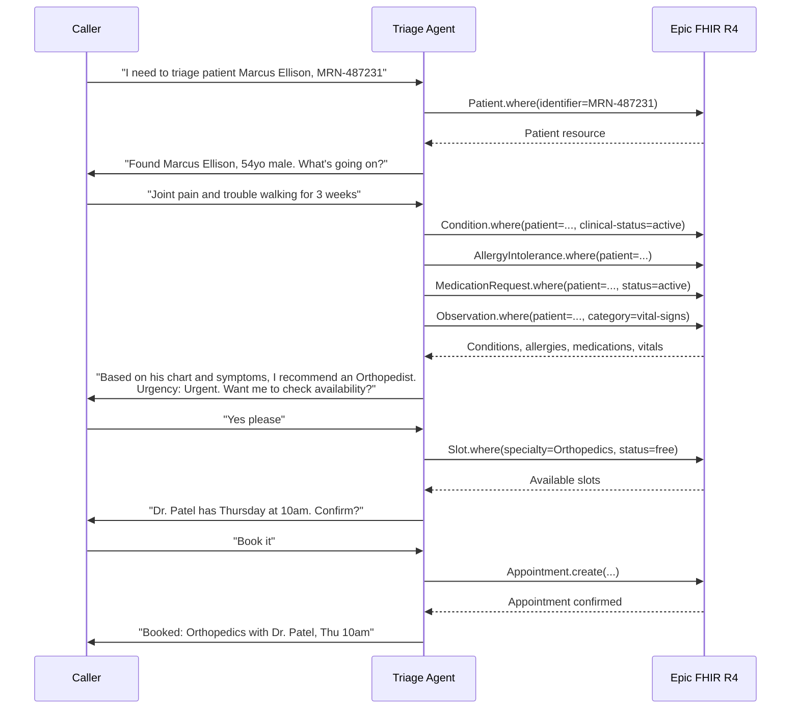
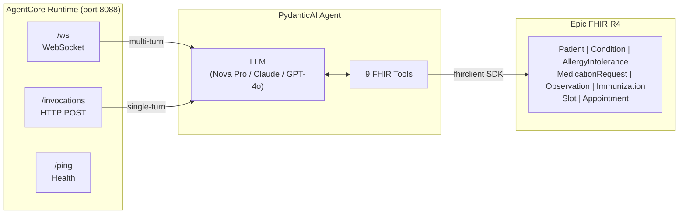
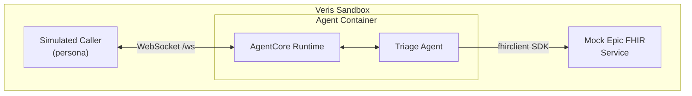

# Medical Triage Agent

A conversational agent that triages patients to the right medical specialist. It connects to an [Epic FHIR R4](https://fhir.epic.com/) API using the [fhirclient](https://pypi.org/project/fhirclient/) SDK to look up patient records, gathers symptoms through multi-turn conversation, recommends a specialist referral, and can book the appointment — all through a single WebSocket session.

Built with [PydanticAI](https://ai.pydantic.dev/) on [Amazon Bedrock AgentCore](https://docs.aws.amazon.com/bedrock-agentcore/latest/devguide/what-is-bedrock-agentcore.html).

## How the agent works

The agent conducts a structured triage conversation over WebSocket:



### What the agent does at each step

1. **Patient lookup** — Searches Epic FHIR by name or MRN using `fhirclient`'s `Patient.where()` API
2. **Symptom gathering** — Asks about chief complaint, duration, severity, and triggers through conversation
3. **Chart review** — Pulls active conditions, allergies, medications, vitals, and immunizations via FHIR resources
4. **Triage recommendation** — Recommends a specialist (Cardiologist, Neurologist, Pulmonologist, Gastroenterologist, Allergist, Dermatologist, Orthopedist, ENT, Endocrinologist, or GP) with urgency level (Routine / Urgent / Emergent)
5. **Appointment booking** — Searches available `Slot` resources by specialty and creates an `Appointment` resource

## Tools

All tools use the [fhirclient](https://pypi.org/project/fhirclient/) SDK with proper FHIR R4 resource models and search semantics.

| Tool | FHIR Resource | What it does |
|---|---|---|
| `search_patient` | `Patient` | Search by name or MRN |
| `get_patient_record` | `Patient` | Read full demographics by ID |
| `get_patient_conditions` | `Condition` | Active diagnoses |
| `get_patient_allergies` | `AllergyIntolerance` | Known allergies and drug sensitivities |
| `get_patient_medications` | `MedicationRequest` | Active prescriptions |
| `get_patient_immunizations` | `Immunization` | Vaccination history |
| `get_patient_vitals` | `Observation` | Recent vital signs (temp, HR, BP, etc.) |
| `check_specialist_availability` | `Slot` | Open appointment slots by specialty |
| `book_referral_appointment` | `Appointment` | Book a referral appointment |

## AgentCore integration

The agent runs on [Amazon Bedrock AgentCore](https://docs.aws.amazon.com/bedrock-agentcore/latest/devguide/what-is-bedrock-agentcore.html), which provides a serverless runtime with built-in endpoints:



**WebSocket `/ws`** — Multi-turn conversation. The agent maintains conversation history in-memory across turns. Send `{"inputText": "..."}`, receive `{"response": "..."}`. The WebSocket connection itself is the session.

**HTTP `/invocations`** — Single-turn requests. Send `{"prompt": "..."}`, receive `{"response": "..."}`. Supports session continuity via `session_id` in request headers.

**Model** — Defaults to Amazon Nova Pro via Bedrock. Override with `BEDROCK_MODEL_ID`, e.g.:
- `BEDROCK_MODEL_ID=us.anthropic.claude-sonnet-4-6` for Claude
- `BEDROCK_MODEL_ID=us.anthropic.claude-haiku-4-5-20251001-v1:0` for Haiku

### Local development

```bash
cd medical-triage-agent
uv sync                            # install dependencies
cp .env.example .env               # configure (defaults to Bedrock)
uv run agentcore dev -p 8088       # start dev server with hot reload
```

In another terminal:
```bash
# Single-turn test
uv run agentcore invoke --dev --port 8088 "Patient Marcus Ellison, MRN-487231, joint pain for 3 weeks"

# Multi-turn via WebSocket
# Connect to ws://localhost:8088/ws
# Send: {"inputText": "Hi, I need to triage a patient"}
```

### Deploy to AWS

```bash
uv run agentcore deploy
uv run agentcore status
```

### Docker

```bash
docker build -t medical-triage-agent .
docker run -p 8088:8088 --env-file .env medical-triage-agent
```

## Running in Veris

[Veris](https://docs.veris.ai) runs automated test scenarios against the agent in a sandboxed environment. It provides a mock Epic FHIR service so the agent can be tested end-to-end without a real Epic instance.



### Setup

```bash
veris login
veris init
```

Set AWS credentials for Bedrock:
```bash
veris env vars set AWS_ACCESS_KEY_ID=AKIA... --secret
veris env vars set AWS_SECRET_ACCESS_KEY=... --secret
veris env vars set AWS_REGION=us-east-1
```

Push and run:
```bash
veris env push
```

The `.veris/veris.yaml` configures:
- **`epic-fhir` mock service** with DNS alias `fhir.epic.com` — intercepts all FHIR API calls
- **WebSocket channel** at `ws://localhost:8088/ws` for persona conversations
- **Agent entry point** — `uv run python src/main.py` (port 8088)

## Project structure

```
medical-triage-agent/
├── src/
│   ├── main.py                # AgentCore app — agent definition, WebSocket & HTTP handlers
│   ├── tools.py               # 9 PydanticAI tool definitions
│   ├── fhir_client.py         # Epic FHIR R4 client (fhirclient SDK)
│   └── scheduling_client.py   # FHIR Slot/Appointment client (fhirclient SDK)
├── .veris/
│   ├── veris.yaml             # Simulation config (mock services, channels, env)
│   ├── Dockerfile.sandbox     # Sandbox container build
│   └── config.yaml            # Environment profiles
├── Dockerfile
├── Makefile
├── pyproject.toml
└── .env.example
```

## Environment variables

| Variable | Default | Description |
|---|---|---|
| `BEDROCK_MODEL_ID` | `us.amazon.nova-pro-v1:0` | Bedrock model to use |
| `AWS_REGION` | `us-east-1` | AWS region for Bedrock |
| `FHIR_BASE_URL` | `https://fhir.epic.com/interconnect-fhir-oauth/api/FHIR/R4` | Epic FHIR R4 endpoint |
| `FHIR_TOKEN` | — | Bearer token for FHIR API authentication |
